<picture>
  <source media="(prefers-color-scheme: dark)" srcset="assets/hero-dark.svg">
  <source media="(prefers-color-scheme: light)" srcset="assets/hero-light.svg">
  
</picture>

 Taking on projects · Working remotely, worldwide

23AG builds AI products and the interfaces around them — decided, designed and built in one place, for founders and small teams.

### Open source

**[ClawdOS](https://github.com/23ag1/ClawdOS)** — The web GUI & productivity workspace for OpenClaw — tasks, news, dashboards, package tracking, skill marketplace. Self-hosted & private.

**[completely](https://github.com/23ag1/completely)** — Quality-first harness for autonomous AI coding agents — deterministic gates + a default-FAIL evaluator over a Beads task spine. Claude Code plugin; done is earned, not asserted.

**[frontend-quality](https://github.com/23ag1/frontend-quality)** — Claude Code plugin: a frontend standard — taste decisions, layout checks in a real browser, a catalogue of failure modes, performance profiling attributed to functions.

**[site-teardown-skill](https://github.com/23ag1/site-teardown-skill)** — Reverse engineers any website into a build blueprint: stack, effects, design tokens, section-by-section plan.

 

<picture>
  <source media="(prefers-color-scheme: dark)" srcset="assets/year-dark.svg">
  <source media="(prefers-color-scheme: light)" srcset="assets/year-light.svg">
  
</picture>

### Elsewhere

[23ag.one](https://23ag.one) · [Lab](https://lab.23ag.one/) · [Telegram](https://t.me/a023aa23) · [X](https://x.com/23agdotone) · [Instagram](https://instagram.com/23ag.one)
